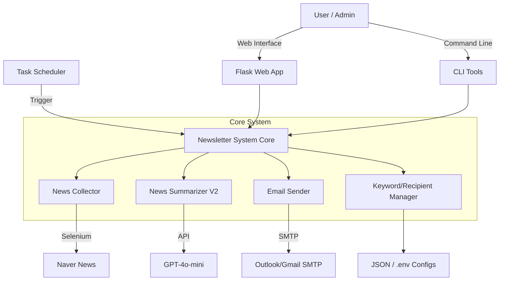

# [IT본부] 하나투어 뉴스레터 자동화 시스템 PRD

## 1. 프로젝트 개요

하나투어 IT본부를 위한 전문 뉴스레터 자동화 시스템입니다. 네이버 뉴스를 자동으로 수집하고 GPT-4o-mini를 활용하여 요약한 후, HTML 형식의 이메일로 발송하는 전 과정을 자동화합니다. 이를 통해 IT, AI, 여행 업계의 최신 동향을 신속하고 효율적으로 공유합니다.

## 2. 목표 및 기대 효과

### 2.1 목표

- **뉴스 수집 자동화**: 매일 지정된 키워드(IT, AI, 여행)에 대한 최신 뉴스 자동 수집
- **고품질 요약 제공**: AI를 활용하여 핵심 내용 위주의 간결하고 정확한 요약 생성
- **운영 효율성 증대**: 수동 뉴스 클리핑 및 배포 업무를 자동화하여 리소스 절감
- **정보 접근성 향상**: 이메일 및 웹 대시보드를 통해 누구나 쉽게 최신 정보 확인 가능

### 2.2 기대 효과

- 최신 기술 및 업계 동향 파악 시간 단축
- IT본부 구성원 간의 정보 격차 해소 및 인사이트 공유 활성화
- 뉴스레터 제작 및 발송에 소요되는 반복 업무 제거

## 3. 타겟 사용자

- **Primary**: 하나투어 IT본부 임직원 (개발자, 기획자, 관리자 등)
- **Secondary**: 여행 및 기술 트렌드에 관심 있는 사내 유관 부서

## 4. 주요 기능 상세

### 4.1 뉴스 수집 (News Collection)

- **소스**: 네이버 뉴스 (Selenium 기반 크롤링)
- **수집 정책**:
  - **IT 분야 (35%)**: AI 인프라, 양자 컴퓨팅, 6G 등
  - **AI 분야 (35%)**: 에이전틱 AI, 온디바이스 AI 등
  - **여행 분야 (30%)**: 하나투어, 경쟁사 동향, 여행 트렌드 등
- **필터링**: 제목 기준 중복 제거, 관련성 및 최신성 검증
- **예외 처리**: 수집 실패 시 샘플 데이터 또는 Fallback 데이터 생성

### 4.2 AI 요약 (AI Summarization)

- **엔진**: GPT-4o-mini
- **방식**: 페르소나 기반 요약 (V2 Engine - Strategy Planner)
- **요약 유형**:
  - **통합 요약**: 주제별 핵심 동향을 하나의 스토리로 엮어서 제공
  - **개별 뉴스 카드**: 각 뉴스별 배지(Badge), 제목, 요약, 인사이트, 링크 제공
  - **배지 시스템**: Innovation, Industry Analysis, Future Tech, Market Power 등 4가지 분류
- **품질 관리**: 전문적 톤앤매너 유지, 가독성 최적화, Hallucination 방지 필터링

### 4.3 이메일 발송 (Email Sending)

- **방식**: SMTP (Outlook 주 사용, Gmail 백업)
- **형식**: 반응형 HTML 템플릿 (V3 Template - `new_templates.html`)
- **내용**:
  - **상단 3줄 요약**: 각 주제별(IT, AI, 여행) 핵심 내용을 1줄로 요약하여 상단 배치
  - **카드형 레이아웃**: 뉴스별 카드 디자인 적용, 직관적인 배지 및 인사이트 강조
  - **Outlook 호환성**: MSO 조건부 주석 등을 활용한 완벽한 렌더링 지원
- **발송 대상**: 관리된 수신자 목록 (단일/대량 발송 지원)

### 4.4 웹 관리자 (Web Admin Interface)

- **기반**: Flask Web Server
- **기능**:
  - 시스템 상태 실시간 모니터링
  - 키워드 및 주제 설정 관리
  - 뉴스레터 미리보기 및 수동 생성/발송
  - 컴포넌트별 테스트 실행

### 4.5 수신자 관리 (Recipient Management)

- **기능**:
  - 수신자 목록 조회, 추가, 삭제, 검색 (Ctrl+F)
  - 대량 추가 (Ctrl+C/V 지원)
  - `.env` 파일과의 동기화 및 가져오기
  - 활성/비활성 상태 관리 및 통계 대시보드

### 4.6 스케줄링 및 운영 (Scheduling & Ops)

- **스케줄러**:
  - 데일리: 매일 오전 9시, 오후 6시 자동 발송
  - 주간: 매주 월요일 오전 9시 발송 (전주 월~일 데이터 기반)
  - 월간: 매월 첫 영업일 오전 9시 발송 (전월 데이터 기반)
- **로깅**: 일별/컴포넌트별 로그 파일 생성 및 로테이션
- **에러 복구**: 재시도(Retry) 로직 및 응급 뉴스레터 발송 기능

### 4.7 아카이빙 및 확장 발송 (Archiving & Extended Newsletters)

- **데일리 HTML 저장**:
  - 발송된 데일리 뉴스레터의 HTML 원본을 파일로 저장 (아카이빙)
  - 저장 경로: `archives/daily/{YYYY}/{MM}/`
  - 파일명: `daily_newsletter_{YYYYMMDD}_{HH}.html`
- **주간 뉴스레터 (Weekly)**:
  - **발송 시간**: 매주 월요일 오전 9시
  - **대상 데이터**: 전주(월~일) 저장된 데일리 HTML 템플릿 활용
  - **내용**: 한 주간의 주요 뉴스 요약 및 카테고리별 하이라이트
  - **제목**: `{M}월 {N}주차 [IT본부] 하나투어 뉴스레터` (주차 자동 계산)
  - **아카이빙**: 발송 후 HTML 파일 저장 (`archives/weekly/`)
- **월간 뉴스레터 (Monthly)**:
  - **발송 시간**: 매월 첫 영업일 (주말/공휴일 제외 시작일)
  - **대상 데이터**: 전월 발송된 주간 뉴스레터 HTML 템플릿 활용
  - **내용**: 월간 트렌드 분석 및 주요 이슈 종합
  - **아카이빙**: 발송 후 HTML 파일 저장 (`archives/monthly/`)

## 5. 기술 아키텍처

### 5.1 시스템 구조

### 5.2 기술 스택

- **Language**: Python 3.8+
- **Web Framework**: Flask
- **Crawling**: Selenium, BeautifulSoup4
- **AI**: OpenAI API (GPT-4o-mini)
- **Scheduling**: schedule, Windows Task Scheduler
- **Frontend**: HTML5, CSS3, Bootstrap (Web Admin)
- **Environment**: Windows (UTF-8 support applied)

## 6. 데이터 흐름

1. **설정 로드**: `.env`, `keywords_config.json`, `recipients.json` 로드
2. **뉴스 수집**: 키워드별 네이버 뉴스 검색 -> 메타데이터 추출 -> 중복 제거
3. **데이터 전처리**: 본문 길이 검증 및 IT 카테고리 내 AI 관련 뉴스를 AI 카테고리로 자동 재분류
4. **AI 요약**: 뉴스 본문/메타데이터 -> GPT-4o-mini (V2 Persona) -> 통합 요약 및 카드 데이터 생성
5. **콘텐츠 생성**: 요약 데이터 -> HTML 템플릿 렌더링
6. **발송**: HTML 콘텐츠 -> SMTP 서버 -> 수신자 이메일

## 7. 비기능 요구사항

- **안정성**: 외부 API(네이버, OpenAI) 장애 시에도 시스템이 멈추지 않고 Fallback 처리되어야 함
- **보안**: API 키 및 이메일 계정 정보는 환경변수로 안전하게 관리
- **호환성**: 이메일 템플릿은 다양한 클라이언트(특히 Outlook)에서 깨짐 없이 보여야 함
- **확장성**: 수신자 수 증가(300명+)에 따른 관리 편의성 및 발송 성능 보장

## 8. 향후 계획 (Roadmap)

- **단기**: 수신자별 맞춤형 뉴스레터 기능 (관심 키워드 구독)
- **중기**: 뉴스 소스 다각화 (구글 뉴스, 테크 블로그 등 추가)
- **장기**: 슬랙(Slack) 등 사내 메신저 봇 연동 및 알림 기능 추가
